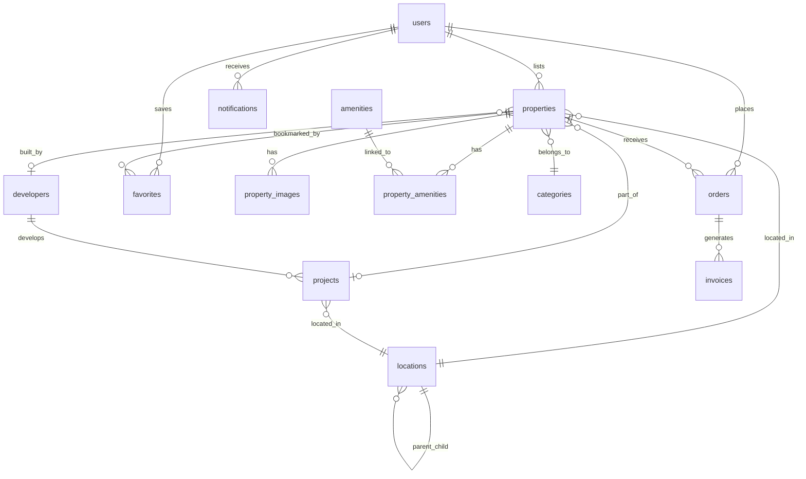

# Data Model: عقارك (Aqarak) Platform

**Phase 1 Output** | **Date**: 2026-03-06

## Entity Relationship Diagram



## Entities

### users

| Field | Type | Constraints |
|-------|------|-------------|
| id | SERIAL | PRIMARY KEY |
| first_name | VARCHAR(100) | NOT NULL |
| last_name | VARCHAR(100) | NOT NULL |
| email | VARCHAR(255) | UNIQUE, NOT NULL |
| phone_number | VARCHAR(50) | UNIQUE, NOT NULL |
| password_hash | VARCHAR(255) | NOT NULL |
| role | ENUM(admin, client, broker) | DEFAULT 'client' |
| profile_picture_url | VARCHAR(255) | NULLABLE |
| preferred_language | VARCHAR(2) | DEFAULT 'ar' |
| created_at | TIMESTAMPTZ | DEFAULT NOW() |
| updated_at | TIMESTAMPTZ | DEFAULT NOW(), auto-trigger |

### properties

| Field | Type | Constraints |
|-------|------|-------------|
| id | SERIAL | PRIMARY KEY |
| user_id | INT | FK → users.id, NOT NULL |
| category_id | INT | FK → categories.id, NOT NULL |
| location_id | INT | FK → locations.id, NOT NULL |
| project_id | INT | FK → projects.id, NULLABLE |
| developer_id | INT | FK → developers.id, NULLABLE |
| title_ar | VARCHAR(255) | NOT NULL |
| title_en | VARCHAR(255) | NULLABLE |
| description_ar | TEXT | NOT NULL |
| description_en | TEXT | NULLABLE |
| listing_type | ENUM(sale, rent) | NOT NULL |
| property_origin | ENUM(primary, resale) | NOT NULL |
| finishing_type | ENUM(core_and_shell, semi_finished, fully_finished, furnished) | NOT NULL |
| legal_status | ENUM(registered, primary_contract, unregistered) | NOT NULL |
| price | DECIMAL(15,2) | NOT NULL |
| currency | VARCHAR(10) | DEFAULT 'EGP' |
| down_payment | DECIMAL(15,2) | NULLABLE |
| installment_years | INT | DEFAULT 0 |
| delivery_date | DATE | NULLABLE |
| maintenance_deposit | DECIMAL(15,2) | NULLABLE |
| commission_percentage | DECIMAL(5,2) | DEFAULT 0.00 |
| area_sqm | DECIMAL(10,2) | NOT NULL |
| bedrooms | INT | NULLABLE |
| bathrooms | INT | NULLABLE |
| floor_level | INT | NULLABLE |
| status | ENUM(pending_approval, approved, rejected, sold, rented, inactive) | DEFAULT 'pending_approval' |
| latitude | DECIMAL(10,8) | NULLABLE |
| longitude | DECIMAL(11,8) | NULLABLE |
| created_at | TIMESTAMPTZ | DEFAULT NOW() |
| updated_at | TIMESTAMPTZ | DEFAULT NOW(), auto-trigger |

**State Transitions**:
- `pending_approval` → `approved` (admin only)
- `pending_approval` → `rejected` (admin only)
- `approved` → `inactive` (owner or admin)
- `approved` → `sold` (admin only — after order completion)
- `approved` → `rented` (admin only — after order completion)
- `approved` → `pending_approval` (automatic — when owner edits listing)
- `inactive` → `approved` (admin only — reactivation)
- `rejected` → `pending_approval` (automatic — when owner edits listing)

### notifications (NEW)

| Field | Type | Constraints |
|-------|------|-------------|
| id | SERIAL | PRIMARY KEY |
| user_id | INT | FK → users.id, NOT NULL |
| event_type | VARCHAR(50) | NOT NULL |
| title_ar | VARCHAR(255) | NOT NULL |
| title_en | VARCHAR(255) | NOT NULL |
| message_ar | TEXT | NOT NULL |
| message_en | TEXT | NOT NULL |
| reference_type | VARCHAR(50) | NULLABLE (e.g., 'property', 'order') |
| reference_id | INT | NULLABLE |
| is_read | BOOLEAN | DEFAULT FALSE |
| created_at | TIMESTAMPTZ | DEFAULT NOW() |

**Event Types**:
- `property_approved` — Property listing was approved by admin
- `property_rejected` — Property listing was rejected by admin
- `property_reactivated` — Inactive listing reactivated by admin
- `order_received` — New order received for seller's property
- `order_accepted` — Order accepted by admin
- `order_rejected` — Order rejected by admin
- `order_completed` — Order marked as completed

### orders

| Field | Type | Constraints |
|-------|------|-------------|
| id | SERIAL | PRIMARY KEY |
| client_id | INT | FK → users.id, NOT NULL |
| property_id | INT | FK → properties.id, NOT NULL |
| total_amount | DECIMAL(15,2) | NOT NULL |
| status | ENUM(pending, accepted, rejected, completed) | DEFAULT 'pending' |
| notes | TEXT | NULLABLE |
| created_at | TIMESTAMPTZ | DEFAULT NOW() |
| updated_at | TIMESTAMPTZ | DEFAULT NOW(), auto-trigger |

**Validation**: client_id ≠ property.user_id (prevent self-ordering)

### invoices

| Field | Type | Constraints |
|-------|------|-------------|
| id | SERIAL | PRIMARY KEY |
| order_id | INT | FK → orders.id, NOT NULL |
| amount | DECIMAL(15,2) | NOT NULL |
| due_date | DATE | NOT NULL |
| status | ENUM(unpaid, paid, overdue, cancelled) | DEFAULT 'unpaid' |
| payment_method | VARCHAR(50) | NULLABLE (informational only) |
| created_at | TIMESTAMPTZ | DEFAULT NOW() |
| updated_at | TIMESTAMPTZ | DEFAULT NOW(), auto-trigger |

### locations

| Field | Type | Constraints |
|-------|------|-------------|
| id | SERIAL | PRIMARY KEY |
| name_ar | VARCHAR(255) | NOT NULL |
| name_en | VARCHAR(255) | NOT NULL |
| type | ENUM(governorate, city, neighborhood) | NOT NULL |
| parent_id | INT | FK → locations.id, NULLABLE |
| | | UNIQUE(name_ar, parent_id), UNIQUE(name_en, parent_id) |

### categories

| Field | Type | Constraints |
|-------|------|-------------|
| id | SERIAL | PRIMARY KEY |
| name_ar | VARCHAR(100) | NOT NULL |
| name_en | VARCHAR(100) | NOT NULL |
| slug | VARCHAR(100) | UNIQUE, NOT NULL |

### developers

| Field | Type | Constraints |
|-------|------|-------------|
| id | SERIAL | PRIMARY KEY |
| name_ar | VARCHAR(255) | UNIQUE, NOT NULL |
| name_en | VARCHAR(255) | UNIQUE, NOT NULL |
| description_ar | TEXT | NULLABLE |
| description_en | TEXT | NULLABLE |
| logo_url | VARCHAR(255) | NULLABLE |
| created_at | TIMESTAMPTZ | DEFAULT NOW() |
| updated_at | TIMESTAMPTZ | DEFAULT NOW(), auto-trigger |

### projects

| Field | Type | Constraints |
|-------|------|-------------|
| id | SERIAL | PRIMARY KEY |
| developer_id | INT | FK → developers.id, NOT NULL |
| location_id | INT | FK → locations.id, NOT NULL |
| name_ar | VARCHAR(255) | NOT NULL |
| name_en | VARCHAR(255) | NOT NULL |
| description_ar | TEXT | NULLABLE |
| description_en | TEXT | NULLABLE |
| delivery_year | INT | NULLABLE |
| created_at | TIMESTAMPTZ | DEFAULT NOW() |
| updated_at | TIMESTAMPTZ | DEFAULT NOW(), auto-trigger |

### property_images

| Field | Type | Constraints |
|-------|------|-------------|
| id | SERIAL | PRIMARY KEY |
| property_id | INT | FK → properties.id, NOT NULL, ON DELETE CASCADE |
| image_url | VARCHAR(255) | NOT NULL |
| is_primary | BOOLEAN | DEFAULT FALSE |
| created_at | TIMESTAMPTZ | DEFAULT NOW() |

### amenities / property_amenities

**amenities**: id, name_ar (UNIQUE), name_en (UNIQUE)

**property_amenities**: property_id (FK), amenity_id (FK), PRIMARY KEY (property_id, amenity_id)

### favorites

| Field | Type | Constraints |
|-------|------|-------------|
| id | SERIAL | PRIMARY KEY |
| user_id | INT | FK → users.id, NOT NULL |
| property_id | INT | FK → properties.id, NOT NULL |
| created_at | TIMESTAMPTZ | DEFAULT NOW() |
| | | UNIQUE(user_id, property_id) |

## Migration Required

New table `notifications` must be added via SQL migration. All other
tables already exist in the schema. See [schema.sql](file:///c:/Users/dell/Desktop/My_Enterprise_Projects/Sales_version(2)_backend/schema.sql) for current schema.

```sql
-- Migration: Add notifications table
CREATE TABLE notifications (
    id SERIAL PRIMARY KEY,
    user_id INT NOT NULL REFERENCES users(id) ON DELETE CASCADE,
    event_type VARCHAR(50) NOT NULL,
    title_ar VARCHAR(255) NOT NULL,
    title_en VARCHAR(255) NOT NULL,
    message_ar TEXT NOT NULL,
    message_en TEXT NOT NULL,
    reference_type VARCHAR(50),
    reference_id INT,
    is_read BOOLEAN DEFAULT FALSE,
    created_at TIMESTAMP WITH TIME ZONE DEFAULT CURRENT_TIMESTAMP
);

CREATE INDEX idx_notifications_user_id ON notifications(user_id);
CREATE INDEX idx_notifications_unread ON notifications(user_id, is_read)
    WHERE is_read = FALSE;
```
